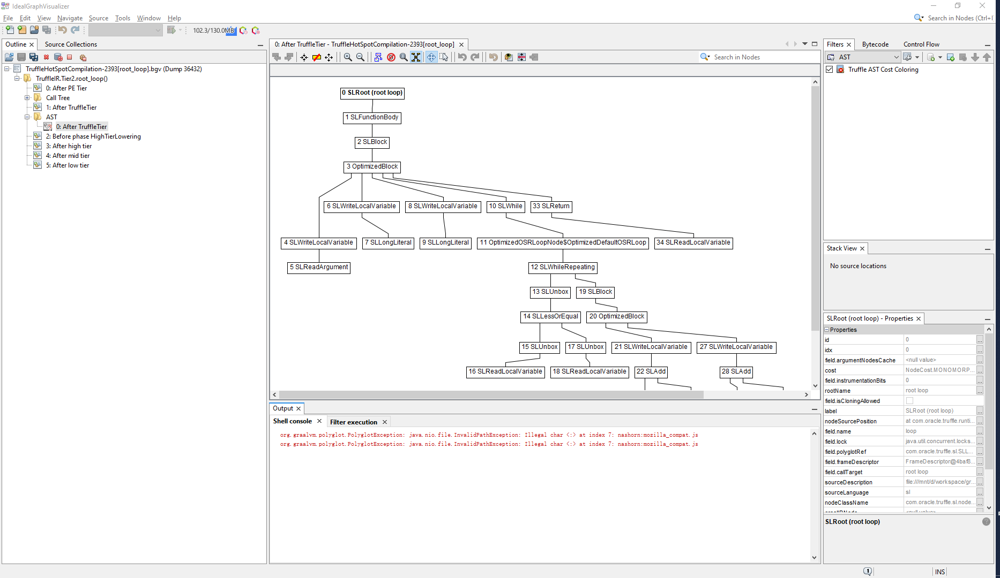

# OpenJDK
* [JDK Project](https://openjdk.org/projects/jdk/): The goal of this long-running Project is to produce a series of open-source reference implementations of the Java SE Platform, as specified by JSRs in the Java Community Process. The Project ships a feature release every six months according to a strict, time-based model, as proposed.
* [OpenJDK Wiki](https://wiki.openjdk.org/): This wiki complements the content in https://openjdk.org.

# HotSpot
* https://wiki.openjdk.org/spaces/HotSpot/overview
* [CompressedOops](https://wiki.openjdk.java.net/display/HotSpot/CompressedOops)
* [Garbage Collection](https://wiki.openjdk.org/spaces/HotSpot/pages/11829261/Garbage+Collection)
* [Synchronization](https://wiki.openjdk.org/spaces/HotSpot/pages/11829266/Synchronization)
* [Memory Management in the JavaHotSpot™ Virtual Machine](https://www.oracle.com/technetwork/java/javase/memorymanagement-whitepaper-150215.pdf). Sun Microsystems. April 2006.

# Leyden
* https://openjdk.org/projects/leyden/

> The primary goal of this Project is to improve the startup time, time to peak performance, and footprint of Java programs.

# Nashorn Engine
* https://github.com/openjdk/nashorn

> Nashorn engine is an open source implementation of the [ECMAScript Edition 5.1 Language Specification](https://es5.github.io/). It also implements many new features introduced in ECMAScript 6 including template strings; `let`, `const`, and block scope; iterators and `for..of` loops; `Map`, `Set`, `WeakMap`, and `WeakSet` data types; symbols; and binary and octal literals. It is written in Java and runs on the Java Virtual Machine.
>
> Nashorn used to be part of the JDK until Java 14. This project provides a standalone version of Nashorn suitable for use with Java 11 and later.

# Tools
## Ideal Graph Visualizer
* https://ssw.jku.at/General/Staff/TW/igv.html The Ideal Graph Visualizer was created by Thomas Wuerthinger in the course of his master's thesis, and extended by Peter Hofer.
* https://www.graalvm.org/latest/tools/igv/
* https://github.com/openjdk/jdk/tree/master/src/utils/IdealGraphVisualizer

> A tool that visualises C1 and C2 behaviour

```shell
mx -p graal/compiler igv

git clone https://github.com/graalvm/mx.git
git clone https://github.com/oracle/graal.git
cd simplelanguage/
./sl -dump language/tests/SumPrint.sl
  
idealgraphvisualizer64.exe --jdkhome C:\Users\Administrator\scoop\apps\openjdk11\current
```



## Jitwatch
A JavaFX tool that gives analytics for JIT Compilation Logs

https://github.com/AdoptOpenJDK/jitwatch/wiki

# See Also
* [**Biased Locking in HotSpot** | Oracle David Dice's Blog](https://blogs.oracle.com/dave/biased-locking-in-hotspot)
  * [JEP 374: Deprecate and Disable Biased Locking](https://openjdk.org/jeps/374): Disable biased locking by default, and deprecate all related command-line options.
* Dice, David / Moir, Mark / Scherer, William. **Quickly Reacquirable Locks**. 2010-01.